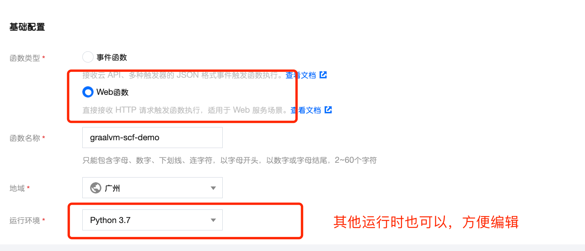
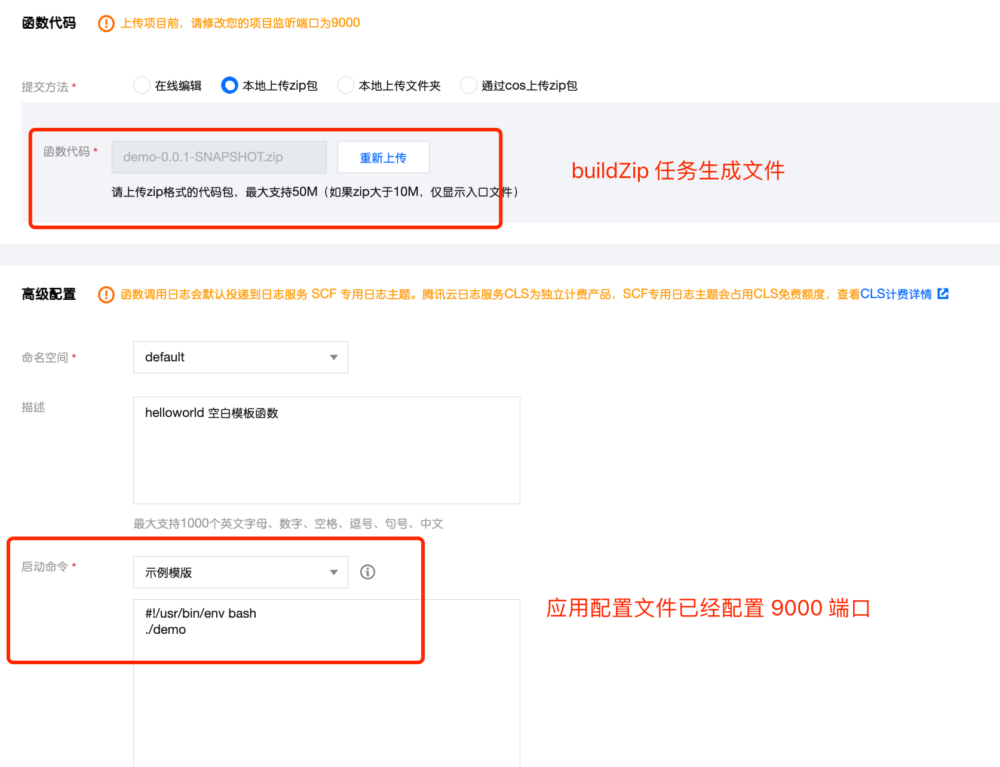
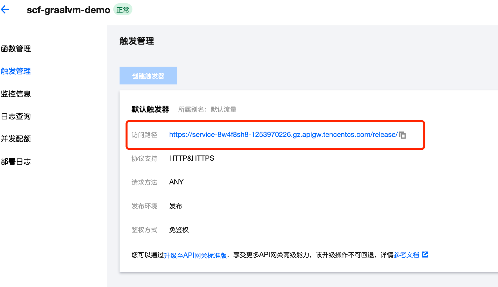
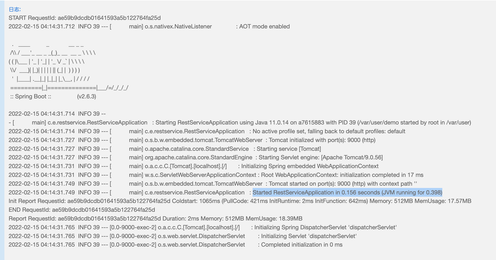

## Demo of GraalVM for SCF


## Build

```bash
gradle nativeCompile
```

Output:

```
build/native/
|-- generated
|   `-- generateResourcesConfigFile
|       `-- resource-config.json
`-- nativeCompile
    |-- demo
    `-- demo.build_artifacts.txt
```

## Zipped Artifacts

```bash
gradle buildZip
```

Artifacts:
```
build/distributions/
`-- demo-0.0.1-SNAPSHOT.zip
```

## Deploy

### Create Function



### Configure `scf_bootstrap`



### Deploy and Check APIGateway Address



### Trigger Function

```bash
curl https://service-2vj0sheq-1253970226.gz.apigw.tencentcs.com/release/greeting
```

Sample Output:

```
{"id":2,"content":"Hello, World!"}%
```

### Check the log


